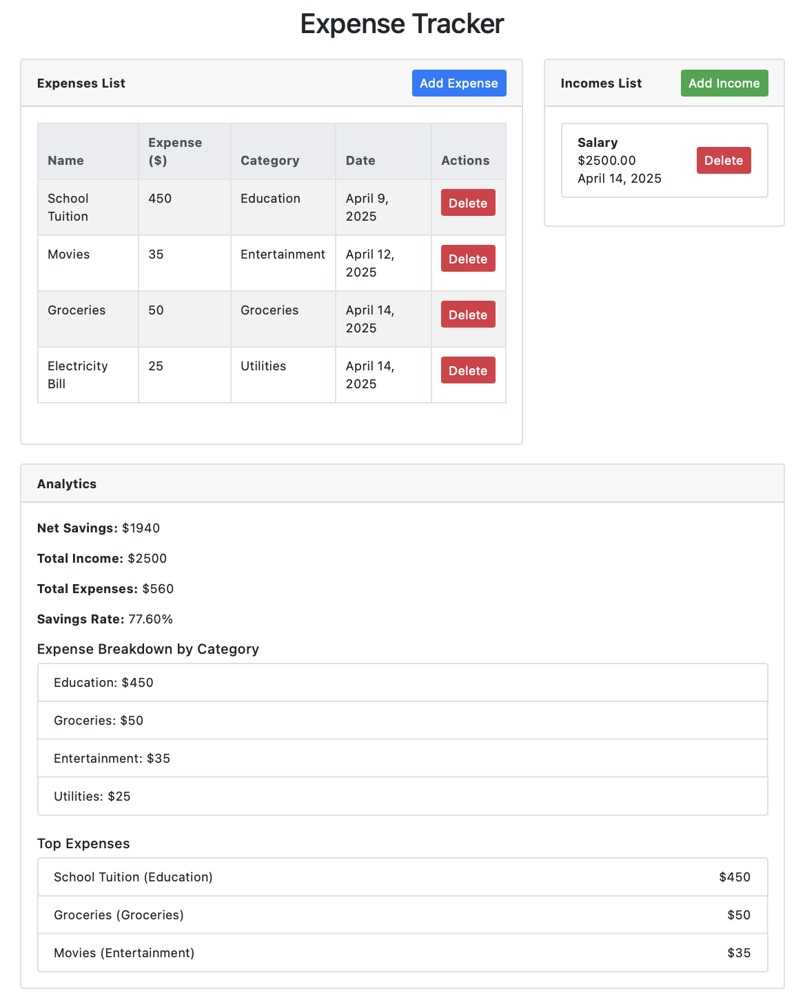
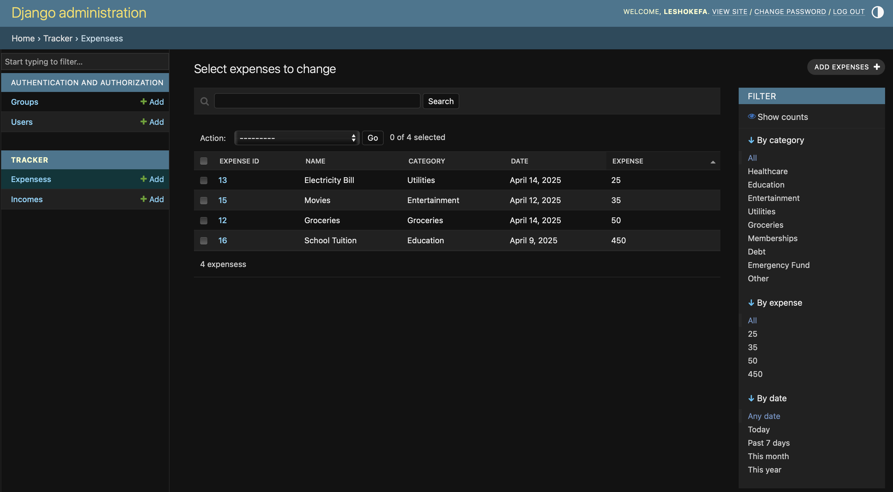

<h1 align="center">Final Capstone Project: <br> Expense Tracker</h1>

This project is a **single page web application** built with [Django](https://www.djangoproject.com/) that helps users track their finances.




## Features

- **Expense & Income Management:**  
  - **Expenses:** Add, view, and delete expense entries with details like name, amount, category, and date.  
  - **Incomes:** Add, view, and delete income entries with details such as source, amount, and date.

- **Analytics Dashboard:**  
  Displays key metrics including:  
  - **Net Savings:** Total Income minus Total Expenses.  
  - **Total Income / Total Expenses:** Overall amounts aggregated from all records.  
  - **Savings Rate:** Calculated as a percentage of income that remains after expenses.  
  - **Expense Breakdown by Category:** Summary of spending per expense category.  
  - **Top Expenses:** A list of the highest expense entries to help identify cost drivers.

- **Single Page Experience:**  
  The entire application is rendered on a single page for a smooth user experience without multiple redirects or page reloads (except when the data is updated).

## Technology Stack

- **Backend:** Python, Django  
- **Database:** SQLite (or any other Django-supported database)  
- **Frontend:** HTML, CSS (Bootstrap), and JavaScript  

## Setup and Installation

1. **Clone the Repository:**
   ```bash
   git clone <repository-url>
   cd <repository-directory>
   
2. **Create and Activate a Virtual Environment:**
   ```bash
   python -m venv venv
   source venv/bin/activate   # On macOS/Linux
   # or on Windows:
   venv\Scripts\activate

3. **Install dependencies**:
   ```bash
   pip install -r requirements.txt

4. **Run database migrations:**
   ```bash
    python manage.py makemigrations
    python manage.py migrate

5. **Start the development server:**
   ```bash
   python manage.py runserver

# Usage

## Adding Expenses:
Click the **"Add Expense"** button within the Expenses section to toggle the inline expense form. Fill out the form and submit it. The new expense will appear in the expenses list.
## Adding Incomes:
Similarly, click the **"Add Income"** button within the Incomes section to reveal the inline income form. Submit the form to update the incomes list.
## Analytics:
The analytics section (always visible below the expense and income lists) shows:
- Net Savings (Total Income minus Total Expenses)
- Total Income
- Total Expenses
- Savings Rate
- Expense Breakdown by Category
- Top Expenses

# Admin Panel

Django comes with a built-in **Admin Panel** that allows you to manage and interact with your application's data easily. You can use the Admin Panel to view and edit your expenses, incomes, and other models directly from a web interface.

### Step 1: Create a Superuser

In order to access the Admin Panel, you need to create a **superuser** with admin privileges. You can do this by following these steps:

1. In your terminal, navigate to the project directory.
2. Run the following command to create a superuser:
   ```bash
   python manage.py createsuperuser
3. You will be prompted to enter the following details:
- Username: Choose a username (e.g., admin)
- Email address: Provide an email address (e.g., admin@example.com)
- Password: Set a strong password for the superuser account.
Once the superuser is created successfully, you will see a confirmation message.

### Step 2: Start the Server
```bash
  python manage.py runserver
```

This will start the server, and you should see output similar to this:
```bash
Starting development server at http://127.0.0.1:8000/
Quit the server with CONTROL-C.
```

### Step 3: Access the Admin Panel
Once the server is running, open your web browser and go to the following URL:

http://127.0.0.1:8000/admin/

You will be prompted to log in using the superuser credentials that you created earlier (username and password).

Once logged in to the Admin Panel, you'll be able to:
- **View and Edit Expenses:** You can add, edit, or delete expenses directly from the admin interface.
- **View and Edit Incomes:** You can manage income records similarly to expenses.




